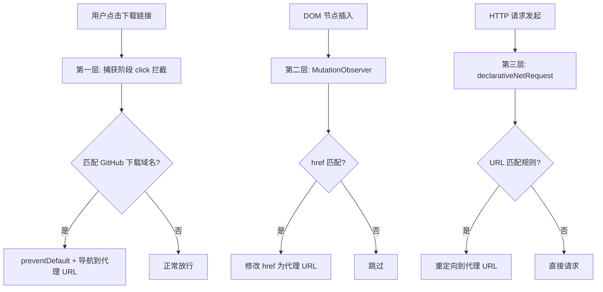

# GitHub Proxy Redirect

[](LICENSE)
[](manifest.json)

> 如果这个项目帮到了你，请点个 Star ⭐ 支持一下！

一个 Edge/Chrome 浏览器扩展，自动将 GitHub 文件下载链接替换为代理地址，解决国内下载缓慢的问题。

**支持的域名：** `github.com` · `raw.githubusercontent.com` · `codeload.github.com` · `release-assets.githubusercontent.com` · `objects.githubusercontent.com`

## 安装

### 开发模式加载

1. 下载或克隆本仓库
2. 打开 `edge://extensions/`（Chrome 则是 `chrome://extensions/`）
3. 开启左下角「开发人员模式」
4. 点击「加载解压缩的扩展」，选择仓库根目录

### 从 Edge 加载项商店安装（待上架）

> 计划上架 Edge Add-ons，届时可直接搜索安装。

## 使用

点击浏览器工具栏的扩展图标，可以随时开关代理功能：

- **开启**（默认）：所有 GitHub 下载链接自动走 `gh-proxy.com`
- **关闭**：恢复原始链接

## 工作原理

三层拦截机制确保代理生效：



| 层级 | 机制 | 拦截时机 | 适用场景 |
|------|------|----------|----------|
| 1 | 捕获阶段 `click` 事件 | 鼠标点击瞬间 | IDM 等下载工具读取 `href` |
| 2 | `MutationObserver` | DOM 节点插入时 | 右键菜单、页面扫描 |
| 3 | `declarativeNetRequest` | HTTP 请求发起前 | 兜底网络层 |

## 项目结构

```
├── manifest.json          # 扩展清单 (MV3)
├── rules.json             # DNR 静态规则（网络层拦截）
├── background.js          # Service Worker（开关控制）
├── content.js             # 内容脚本（DOM 层拦截 + click 捕获）
├── popup/
│   ├── popup.html         # 弹出面板 UI
│   └── popup.js           # 开关逻辑
├── icons/
│   └── icon.svg           # 图标源文件（可转 PNG）
├── LICENSE
└── README.md
```

## 图标

`icons/icon.svg` 是矢量源文件。浏览器扩展需要 PNG 格式：

```bash
# 用浏览器打开 icons/icon.svg，截图或使用在线工具转换
# 需要三张：16x16、48x48、128x128

# 或使用 ImageMagick
magick icons/icon.svg -resize 16x16  icons/icon16.png
magick icons/icon.svg -resize 48x48  icons/icon48.png
magick icons/icon.svg -resize 128x128 icons/icon128.png
```

然后将 `manifest.json` 中的 `icons` 字段取消注释并填上对应路径。无图标时扩展也能正常运行，使用默认首字母图标。

## 修改代理地址

默认使用 `gh-proxy.com`。如果要换成其他代理，修改以下文件中的字符串：

- `content.js`：`toProxyUrl` 函数
- `rules.json`：每条规则的 `regexSubstitution`
- `background.js`：无需修改

全局搜索替换 `gh-proxy.com` 即可。

## FAQ

**为什么不用 Chrome Web Store 上架？**

可以同时上架。Edge Add-ons 和 Chrome Web Store 的审核流程不同，建议先上 Edge（审核较快），再上 Chrome。

**IDM 仍然抓到了原始链接？**

IDM 的浏览器扩展会在点击时读取 `<a>` 标签的 `href`。本扩展的第一层拦截（捕获阶段 click）专门处理这个问题。如果仍有问题，请确认扩展已重新加载，并检查 `edge://extensions` 是否有报错。

**会影响正常浏览 GitHub 吗？**

不会。只拦截 `main_frame` / `sub_frame` 类型的请求（即点击链接触发的导航），不影响页面内加载的图片、脚本、样式。

## License

MIT

---

如果这个项目对你有帮助，欢迎点个 ⭐ Star，让更多人看到！